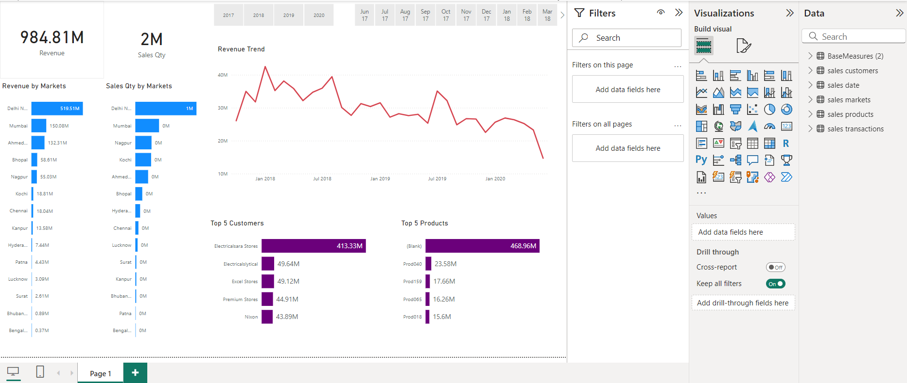

# Data Analysis: Sales Insights

This project involves the analysis of sales data using **MySQL** for data querying and **Power BI** for data visualization. The data is cleaned, analyzed, and visualized to derive key insights into sales performance.

## Project Overview
- **Technologies Used**: MySQL, Power BI
- **Purpose**: Clean data, perform SQL queries for insights, and visualize results.
## Visualization Output

Here’s a screenshot of the final output in Power BI:



## Instructions to Set Up MySQL

1. Download the database dump (`db_dump.sql`) file from this repository to your local computer.
2. Import the SQL dump into MySQL:
   ```bash
   mysql -u yourusername -p yourpassword yourdatabase < db_dump.sql


Data Analysis Using SQL
###SQL Commands

To retrieve all customer records from the `customers` table, use the following SQL query:

```sql
 1. Show All Customer Records

SELECT * FROM customers;

2.Show total number of customers

SELECT count(*) FROM customers;

3.Show transactions for Chennai market (market code for chennai is Mark001

SELECT * FROM transactions where market_code='Mark001';

4.Show distrinct product codes that were sold in chennai

SELECT distinct product_code FROM transactions where market_code='Mark001';

5.Show transactions where currency is US dollars

SELECT * from transactions where currency="USD"

6.Show transactions in 2020 join by date table

SELECT transactions.*, date.* FROM transactions INNER JOIN date ON transactions.order_date=date.date where date.year=2020;

7.Show total revenue in year 2020,

SELECT SUM(transactions.sales_amount) FROM transactions INNER JOIN date ON transactions.order_date=date.date where date.year=2020 and transactions.currency="INR\r" or transactions.currency="USD\r";

8.Show total revenue in year 2020, January Month,

SELECT SUM(transactions.sales_amount) FROM transactions INNER JOIN date ON transactions.order_date=date.date where date.year=2020 and and date.month_name="January" and (transactions.currency="INR\r" or transactions.currency="USD\r");

9.Show total revenue in year 2020 in Chennai

SELECT SUM(transactions.sales_amount) FROM transactions INNER JOIN date ON transactions.order_date=date.date where date.year=2020 and transactions.market_code="Mark001";

10.Data Analysis Using Power BI
Formula to create norm_amount column
= Table.AddColumn(#"Filtered Rows", "norm_amount", each if [currency] = "USD" or [currency] ="USD#(cr)" then [sales_amount]*75 else [sales_amount], type any)
